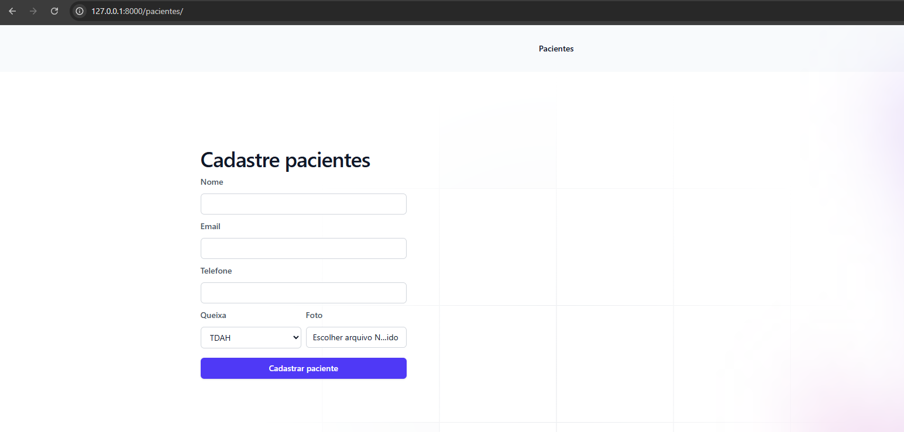
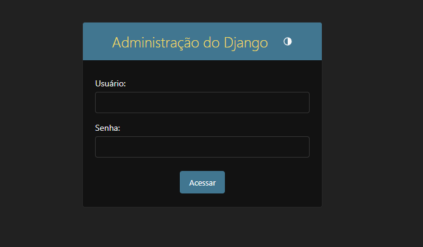

# psicologo-manager-python
🧑‍⚕️Sistema de Gerenciamento para Psicólogos com Python | Projeto 

<p>
  
  
  
  <a href="https://opensource.org/licenses/MIT">
    
  </a>
  
</p>

<br>
## Tópicos

[Sobre o Projeto](#sobre-o-projeto)

[Tecnologias](#tecnologias)

[Instalação e Uso](#instalação-e-uso)

[Licença](#licença)

<br>

## Sobre o Projeto

Psicólogo Manager é um sistema desenvolvido em Python para auxiliar psicólogos na gestão de seus pacientes. O sistema permite o cadastro e consulta de pacientes, o registro detalhado das consultas realizadas e a anexação de vídeos para monitoramento da evolução do paciente. Além disso, gera um link personalizado para que o paciente possa acessar seu progresso, incluindo vídeos e gráficos que mostram a quantidade de sessões realizadas. Com uma interface intuitiva e recursos avançados, o Psicólogo Manager facilita o acompanhamento terapêutico, tornando a gestão mais eficiente e organizada.

<p align="center">
  
  
</p>

<br>

## Tecnologias

As seguintes tecnologias foram utilizadas no desenvolvimento do projeto:

- [Python](https://www.python.org/)
- [Django](https://www.djangoproject.com/)
- [Pillow](https://python-pillow.org/) (para manipulação de imagens)

<br>

## Instalação e Uso

## Pré-requisitos

Antes de começar, você precisa ter o Python 3.x instalado no seu sistema. Você pode baixar o Python [aqui](https://www.python.org/downloads/).

## Passos para Configuração e Execução

1. **Clone o repositório**:

  Abra seu terminal e clone o repositório do projeto:

  ```bash
  git clone https://github.com/yMiguelzin/psicologo-manager-python.git

  ```
2. **Ative o ambiente virtual (opcional, mas recomendado)**:

  Navegue até a pasta do projeto e crie/ative um ambiente virtual:

  ```bash
  # Criar
    
  #Linux
  python3 -m venv venv
    
  #Windows
  python -m venv venv
  ```

<br>

Após a criação do venv vamos ativa-lo:

  ```bash
  #Ativar

  #Linux
  source venv/bin/activate
  
  #Windows
  venv\Scripts\Activate

  # Caso algum comando retorne um erro de permissão execute o código e tente novamente:
  Set-ExecutionPolicy -Scope CurrentUser -ExecutionPolicy RemoteSigned

  ```

3. **Instale as dependências**:

  Navegue até a pasta do projeto e instale as dependências necessárias:

  ```bash
  Dependências

  pip install django
  pip install pillow
  pip install matplotlib

  ```

4. **Configuração do Banco de Dados**:

  Agora, configure o banco de dados. Execute os comandos abaixo para criar as migrações necessárias e aplicá-las ao banco de dados e criar o superuser admin:
  
  ```bash
  python manage.py makemigrations
  python manage.py migrate

  python manage.py createsuperuser

  ```
5. **Execute no terminal**:

  Inicie o servidor de desenvolvimento para rodar a aplicação localmente:
  
  ```bash
  python manage.py runserver

  O servidor será executado em http://localhost:8000/pacientes
  Abra esse endereço no seu navegador para começar a usar a aplicação.

  Painel Adminstrador é acessado pelo
  será executado em http://localhost:8000/admin
  
  ```

  <br>
  
## Licença
<a href="https://opensource.org/licenses/MIT">
    
</a>

<br>


Esse projeto está sob a licença MIT. Veja o arquivo [LICENSE](/LICENSE) para mais detalhes.

---

Feito com :purple_heart: by [Miguel Marostica](https://github.com/yMiguelzin)
